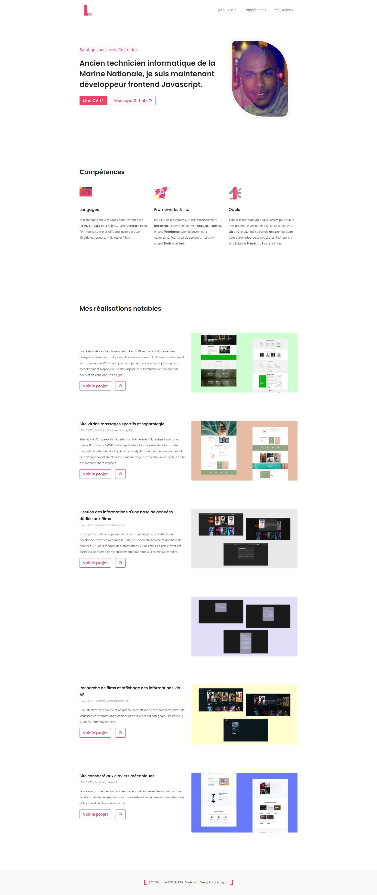

# About "about-me"

My personal website made with Vue.js.

For now it is an experiment of very simple and minimal portfolio to get hired. The essential before all.

## Phylosophy

I try to keep this project simple and minimal as possible with no dépendencies :trollface: .

## I use in this project:

- HTML5 and CSS3 (SASS)
- Javascript
- Bootstrap (+ jQuery & Popper)
- Animate css
- Vue.js (standalone file)
- Line awesome
- Gulp (Browser sync, sass compiler,images minifier)

## Development setup

If you want to fork and custom this project you need Node.js and npm.

1. Clone repo (new CLI):

```sh
gh repo clone LionelENSFELDER/about-me
```

2. Install node_modules:

```sh
npm i
```

3. Start local server :

```sh
npm run serve
```

